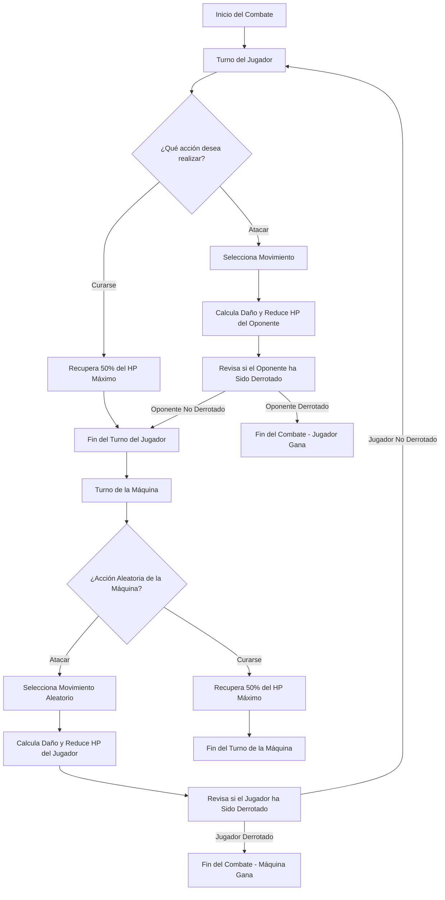

# **Simulador de Batallas Pokémon en JavaScript**

#### **Descripción del Proyecto**
Este proyecto consiste en desarrollar un simulador de batallas Pokémon utilizando JavaScript, recreando una experiencia de combate por turnos entre un jugador y un oponente controlado por la máquina. Los Pokémon tienen características como nombre, tipo, puntos de vida (HP), ataque, defensa y una lista de movimientos únicos. Cada turno, el jugador puede optar por atacar o curarse, mientras que las acciones de la máquina son completamente aleatorias.

#### **Objetivos Específicos**
1. **Diseño de Clases y Estructura del Código**:
    - **Clase `Pokemon`**: Define los atributos esenciales de un Pokémon:
        - **Atributos**: Nombre, tipo, HP actual, HP máximo (`hpMax`), ataque, defensa, y una lista de movimientos (`Move`).
        - **Método `attack()`**: Permite al Pokémon atacar seleccionando un movimiento de su lista y calculando el daño infligido.
        - **Método `heal()`**: Cura al Pokémon un 50% de su HP máximo, y solo puede usarse una vez por combate.
    - **Clase `Move`**: Representa los movimientos de ataque con atributos como nombre y daño base.
    - **Enumeración `Type`**: Enumera los diferentes tipos de Pokémon, como Agua, Fuego, Planta, entre otros, para implementar afinidades y debilidades futuras.

2. **Mecánica de Batalla**:
    - Implementar un sistema de turnos donde el jugador puede elegir entre atacar o curarse, y las acciones de la máquina sean completamente aleatorias.
    - Calcular el daño basado en una fórmula que considere las estadísticas de ataque y defensa de los Pokémon involucrados.
    - Incluir la posibilidad de curación para ambos Pokémon, restringiéndola a una vez por combate.

3. **Interacción del Usuario y Flujo de Combate**:
    - Utilizar la librería `readline-sync` para recibir las entradas del jugador y mostrar los resultados de cada acción.
    - Estructurar el flujo del combate para mantener la claridad en la presentación de cada turno y las acciones realizadas.

#### **Fórmula para Calcular el Daño**
El daño infligido por un ataque se calcula usando una fórmula que considera las estadísticas de ataque del atacante, la defensa del defensor y el daño base del movimiento seleccionado. La fórmula es la siguiente:

```
Damage = (Attack / Defense) * Move Damage * Random Factor
```

- **Attack**: El valor de la estadística de ataque del Pokémon atacante.
- **Defense**: El valor de la estadística de defensa del Pokémon defensor.
- **Move Damage**: El valor base de daño del movimiento utilizado.
- **Random Factor**: Un factor aleatorio entre 0.85 y 1.0 que introduce variabilidad en los ataques, simulando la inexactitud y el elemento de suerte presente en los juegos originales.

La fórmula asegura que el daño nunca sea negativo y siempre al menos 1 punto para que cada ataque tenga un impacto mínimo.

#### **Mecánica de las Acciones de la Máquina**
- **Acciones Aleatorias**: La IA selecciona sus acciones de manera completamente aleatoria en cada turno, eligiendo entre atacar o curarse si no lo ha hecho anteriormente.
  - **Ataque Aleatorio**: Selecciona un movimiento al azar de su lista de ataques y lo utiliza contra el Pokémon del jugador.
  - **Curación Aleatoria**: Si la IA decide curarse, esta acción solo puede realizarse una vez por combate, recuperando un 50% de su HP máximo.

#### **Interacción del Jugador**
- El jugador puede elegir entre dos opciones en cada turno:
  - **Atacar**: Selecciona uno de los movimientos disponibles de su Pokémon y ataca al oponente.
  - **Curarse**: El jugador puede curar a su Pokémon una vez durante el combate, recuperando la mitad de su HP máximo.

#### **Diagrama de Flujo del Combate**
A continuación, se presenta un diagrama de flujo utilizando Mermaid que ilustra el proceso de toma de decisiones en cada turno del combate.



#### **Expansiones Posibles: Descripción**

1. **Aplicar Afinidades de Tipos en el Cálculo del Daño**: 
   Incorporar las ventajas y desventajas de los tipos de Pokémon en el cálculo del daño, haciendo que algunos ataques sean más o menos efectivos según el tipo del oponente, lo cual añade una capa estratégica a los combates.

2. **Realizar Combate Completo de Pokémon 3vs3, 6vs6, etc.**: 
   Permitir batallas por equipos donde varios Pokémon se enfrentan en secuencia, gestionando los recursos de varios miembros del equipo, lo que aumenta la complejidad y estrategia del juego.

3. **Introducir Niveles Aleatorios en Pokémon y Modificar el Cálculo del Daño de Acuerdo a Estos**: 
   Asignar niveles a los Pokémon, ajustando sus estadísticas y modificando el daño basado en la diferencia de niveles entre los combatientes, lo que añade un componente de progresión y desafío.

4. **Posibilidad de Fallar un Movimiento**: 
   Añadir una probabilidad de fallo en los movimientos, incorporando un elemento de riesgo y variabilidad en cada ataque, lo que incrementa la estrategia y tensión en los combates.